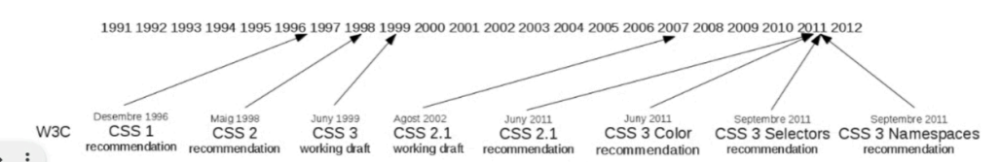
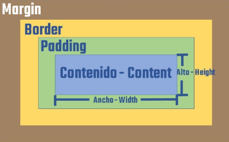
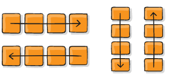

# AISX_0373_A00_IntroGithub
## Primer repositorio del curso 2025-26 de ASIX1.
### Es mi primera toma de contacto con GitHub.
#### Soy Daniel Vega Macias

------------------------------------------------------------------------

## Markdown

Markdown es un lenguaje que se usa para dar formato a texto de manera sencilla.

Esto está __negrita__  
Esto está en **negrita**

Esto está en _cursiva_  
Esto está en *cursiva*

**_TEXTO_**

1. Elemento 1
    * Elemento desordenado 1.1
    * Elemento desordenado 1.2
2. Elemento 2
    * Elemento desordenado 2.1
    * Elemento desordenado 2.2
3. Elemento 3
    * Elemento desordenado 3.1
    * Elemento desordenado 3.2

[link](https://markdown.es/ "Manual oficial markdown")


| Jugador | dorsal | nombre |
|-------|:----------:|:------------------|
| 77 | Cadiz | Fali |
| 33 | Levante | Etta Eyong |
| 20 | Ponfe | JH |

--------------------------------------------------------------------------------------------------------------

#### GIT

Git es un sistema de control de versiones distribuido. Esto significa que permite registrar los cambios de archivos y proyectos a lo largo del tiempo, de forma que puedas:

1. Volver a versiones anteriores si algo sale mal.
2. Trabajar en equipo sin perder cambios de otros.
3. Mantener un historial completo de todas las modificaciones.
4. Conceptos clave de Git
5. Repositorio (repo): Carpeta donde Git guarda todo el historial de un proyecto.
6. Commit: Guardar un cambio específico en el historial del proyecto.
7. Branch (rama): Línea paralela de desarrollo para trabajar sin afectar la versión principal.
8. Merge: Combinar los cambios de una rama con otra.
9. Push: Subir los cambios locales a un servidor remoto (como GitHub).
10. Pull: Traer los cambios de un repositorio remoto a tu máquina local.

###### Comandos GIT

1. git init → iniciar
2. git add → añadir
3. git commit -m "nombre para el commit" → hacer commit
4. git push origin main → subir commit a GitHub

--------------------------------------------------------------------------------------------------------------

#### GitHub

GitHub es una plataforma en la nube que se utiliza para almacenar y gestionar proyectos que usan Git. Es como un lugar online donde los desarrolladores pueden guardar su código, colaborar y compartir proyectos con otros.

1. **Conceptos clave**
    - **Repositorio (repo):** Lugar donde se guarda el código.
    - **Commit:** Registro de un cambio en el código.
    - **Branch (rama):** Versión paralela del proyecto.

2. **Flujo de trabajo básico**
    - Crear o clonar un repositorio.
    - Crear una rama para trabajar.
    - Hacer cambios y confirmarlos (commit).
    - Subir los cambios (push).
    - Crear un Pull Request para fusionar en la rama principal.

3. **Como crear un repo**
    - Entraremos en la web de GitHub
    - Completa los campos:

        1. Repository name: Nombre del repositorio (por ejemplo, mi-primer-repo).
        2. Description (opcional): Breve descripción del proyecto.
        3. Public/Private:
        4. Public: Cualquiera puede ver el repositorio.
        5. Private: Solo tú y colaboradores invitados pueden verlo.
    - Añadir Readme
    - Presionar el boton de "Create Repository"
    - Abrir la carpeta de Repositorios
    - Ejecutar el siguinete comando en el cmd con la ruta de la carpeta de los repositorios "git clone https://github.com/tu-usuario/mi-primer-repo.git"
    - Ya tendremos el repositorio creado

4. **Como hacer un commit**
    - Primeramente necesitamos hacer cambios en nuestro archivo
    - Entramos en la carpeta de nuestro reporsitorio
    - Ejecutamos los siguinetes comandos en orden
        1. git init
        2. git add
        3. git commit -m "nombre para el commit"
        4. git push origin main → subir commit a GitHub


--------------------------------------------------------------------------------------------------------------

# Introducción a HTML

## ¿Qué es HTML?

**HTML (HyperText Markup Language)** 

Es el lenguaje estándar utilizado para crear páginas web.  
Es la base de todo Internet: sin HTML, los navegadores no podrían mostrar ningún contenido.

## Funciones de HTML

- Define la **estructura** y el **contenido** de una página web.  
  Ejemplos: texto, imágenes, listas, enlaces, párrafos, títulos, etc.
- **No define la apariencia** del sitio (eso se hace con **CSS**).
- Es un lenguaje **lógico, estructurado y fácil de entender**.

### Etiquetas básicas de HTML:

##### Estructura principal

```
<!DOCTYPE html> --> Declara el tipo de documento
<html> --> Elemento raíz de la página
<head> --> Contiene información de la página (metadatos)
<title> --> Título de la página que aparece en la pestaña
<meta>  --> Información sobre la página, como codificación y descripción
<link> --> Vincula archivos externos, como CSS
</head>
<body> --> Contenido visible de la página
</body>
</html>
```
##### Texto y encabezados

```
<h1> ... </h1> --> Encabezado principal
<h2> ... </h2> --> Encabezado secundario, hasta h6
<p> ... </p> --> Párrafo
<br> --> Salto de línea
<hr> --> Línea horizontal / separador
```
#### Formato de texto

```
<strong> ... </strong> --> Negrita
<b> ... </b> Negrita
```

### Listas

```
Lista desordenada -->

<ul>
  <li>Item 1</li>
  <li>Item 2</li>
</ul>

Lista ordenada -->

<ol>
  <li>Primer elemento</li>
  <li>Segundo elemento</li>
</ol>
```

## Enlaces e imágenes
```
Hipervínculo --> <a href="https://ejemplo.com">Enlace</a>
Imagen -->
```

## Tablas
```
<table>
  <tr> --> Fila
    <th>Encabezado</th> --> Celda de encabezado
    <th>Encabezado 2</th>
  </tr>
  <tr>
    <td>Dato 1</td> --> Celda de datos
    <td>Dato 2</td>
  </tr>
</table>
```

##
```
Contenedor genérico --> <div> ... </div>
Contenedor en línea --> <span> ... </span>
Dejar espacio --> <br>
Poner linea --> <hr>
```

## Formularios en HTML

```html
<!DOCTYPE html>
<html lang="es">
<head>
    <meta charset="UTF-8">
    <meta name="viewport" content="width=device-width, initial-scale=1.0">
    <title>ASIX-0373-IntroHTML</title>
</head>
<body>
    <!--A continuación he puesto un encabezado -->
    <h1>Introducción HTML</h1>
    
    <p>Lorem</p><strong>Impus dolor</strong>

    <form action="URLdeDestino" method="POST">
        <label for="username">Username:</label>
        <input type="text" name="username" id="username" required>
        <br>

        <label for="realname">Nombre real:</label>
        <input type="text" name="realname" id="realname">
        <input type="radio" name="carnet" value="carnetsi">
    </form>

    <table border="1">
        <thead>
            <tr>
                <td>ORDEN</td>
                <td>ATLETA</td>
                <td>TIEMPO</td>
            </tr>
        </thead>
        <tbody>
            <tr>
                <td>1</td>
                <td>Iker</td>
                <td>03:51:02</td>
            </tr>
            <tr>
                <td rowspan="2">2</td>
                <td colspan="2">Juan</td>
            </tr>
            <tr>
                <td>Dani</td>
                <td>03:51:02</td>
            </tr>
        </tbody>
        <tfoot>
            <tr>
                <td>ORDEN</td>
                <td>ATLETA</td>
                <td>TIEMPO</td>
            </tr>
        </tfoot>
    </table>
    <caption>Tabla </caption>

    <form action="URLdeDestino.html" method="GET">
        <label for="username">Username:</label>
        <input type="text" name="username" id="username" required>
        <br>

        <label for="realname">Nombre real:</label>
        <input type="text" name="realname" id="realname">
        <br>

        <fieldset>
            <legend>Carnet de conducir</legend>
            <label for="carnetsi">SI:</label>
            <input type="radio" name="carnet" value="carnetsi" id="carnetsi">
            <label for="carnetno">NO:</label>
            <input type="radio" name="carnet" value="carnetno" id="carnetno">
        </fieldset>

        <br>

        <fieldset>
            <legend>Gustos musicales</legend>
            <label for="pop">Pop:</label>
            <input type="checkbox" name="musica[]" value="pop" id="pop">
            <label for="heavy">Heavy:</label>
            <input type="checkbox" name="musica[]" value="heavy" id="heavy">
            <label for="pachanga">Pachanga:</label>
            <input type="checkbox" name="musica[]" value="pachanga" id="pachanga">
        </fieldset>

        <br>

        <label for="nacioniladidad">Nacionalidad:</label>
        <select name="Nacionalidad" id="nacioniladidad">
            <option value="españa">España</option>
            <option value="EEUU">EEUU</option>
            <option value="Brasil">Brasil</option>
            <option value="Francia">Francia</option>
        </select>

        <br>

        <label for="observaciones">Observaciones:</label><br>
        <textarea name="observaciones" id="observaciones" cols="25" rows="3" placeholder="Introduce aqui cualquier observacion que tengas"></textarea>

        <br>

        <button type="submit" name="Enviar" value="enviar">Enviar Datos</button>
    </form>
</body>
</html>
```
--------------------------------------------------------------------------------------------------------------
## CSS

### CSS: Evolución y función
En los inicios de la web, las páginas HTML se encargaban tanto del contenido como de la apariencia visual, lo que generaba un código muy difícil de leer y saturado. Para solucionar esto y separar la estructura de la presentación, se crearon las Hojas de Estilo en Cascada (CSS). Mientras que HTML define qué es cada elemento, CSS le indica al navegador cómo debe mostrarlo.

La creación de CSS fue el resultado de un proceso de selección por parte del W3C, que en los años 90 evaluó diversas propuestas hasta estandarizar el CSS Level 1 a finales de 1996. Posteriormente, el lenguaje continuó evolucionando con la llegada de CSS Level 2 en 1998 y su revisión más conocida, CSS 2.1 que es la que se usa actualmente.




### CSS: Ventajas e inconvenientes
Las ventajas de usar hojas de estilo son:

    - Posibilidad de mantener el código más fácilmente

    - A nivel de diseño, CSS es más potente que las etiquetas de diseño de (X)HTML.

    - CSS es un lenguaje sencillo.

    - Se pueden definir diferentes hojas de estilo para un solo documento (X)HTML, por ejemplo, un estilo para la página web cuando se visita desde un ordenador y otra para cuando queramos imprimiria.

    - Se pueden reutilizar desde diferentes documentos (X)HTML.

El gran inconveniente es que no todos los navegadores se comportan de la misma forma ante una hoja de estilo dado que algunos no cumplen con los estándares establecidos. Así, obligan al programador a crear diferentes hojas de estilo.

### Ubicación
Los estilos se pueden asociar de diferentes maneras a los elementos (X)HTML dado que se pueden ubicar las propiedades CSS en diferentes ubicaciones:

#### - Inline
Es la forma más directa de aplicar estilos en Markdown, ya que la mayoría de los procesadores aceptan etiquetas HTML básicas. Su usa directamente en la etiqueta de contenido.

```css
<p style="color: blue; font-size: 20px;">Este es un párrafo azul.</p>
```

#### - Interno. En la cabecera del documento (X)HTML.
En la cabecera del documento (X)HTML: (estilo INTERNO) Podemos poner diferentes propiedades CSS dentro del elemento "style", dentro del elemento "head" del documento. 

```html
<!DOCTYPE html>
<html lang="es">
<head>
    <style>
        p {
            text-align:center;
            color:red
        }
    </style>
</head>
<body>
    <p>Párrafo centrado rojo</p>
    <p>Párrafo centrado rojo</p>
    <p>Párrafo centrado rojo</p>
</body>
</html>
```

#### - Estilo Externo
En un documento externo: (estilo externo) Se coloca las propiedades de estilo en un documento externo con extensión .css y desde el documento (X)HTML se enlaza con esta hoja de estilo con la etiqueta "link" dentro del elemento "head".

```html
<!DOCTYPE html>
<html>
<head>
    <link rel="stylesheet" href="estils.css" type="text/css" />
</head>
<body>
    <p>Párrafo centrado rojo</p>
</body>
</html>
```

### Prioridad

Podría darse el caso de que varias delaraciones CSS afectasen de forma diferente a un mismo elemento HTML, así pues, cual de ellas es la que tendrà preferencia?

    - En primer lugar, se comprueba si existe una hoja de estilos externa asociada al documento HTML (estilo externo). Si no estilos en otras ubicaciones son las que se     ejecutarán.

    - En segundo lugar, si hay alguna definición de estilos en el HEAD del documento HTML (estilo interno). En este caso, si alguna definición contradice a la definida en la hora de estilos externa, tendrá prioridad la definición del estilo interno.

    - Por último, si hay alguna definición de estilos "inline", en la propia etiqueta HTML, en caso de contradicción, tendrá prioridad la definida en la propia etiqueta.

Se ha de tener en cuenta también que el orden dentro de cada estilo es importante, teniendo más prioridad "por regla general los situado más abajo en el documento y que en caso de que haya declaraciones sobre un mismo elemento en diferentes ámbitos que no sean contradictorias.

#### 1. Especificidad

La especificidad se calcula en función de un sistema de puntuación basado en las partes del selector:

- Inline styles (atributo style en HTML):
Especificidad=1000.
- Ejemplo: 
```html
<div style="color: red;">.
```
- Selectores de ID (#id):
Especificidad=100.
- Ejemplo:
```css
#header 
```

- Selectores de clase, atributos y pseudoclases (class, [attr value], hover)
Especificidad=10.
- Ejemplo: 
```css
main, [type="text"], focus.
```
- Selectores de elementos y pseudoelementos (h1, p. before):
Especificidad 1.
- Ejemplo: 
```css
h1, p.
```

- Universal selector (*), combinadores (+,>,-) y pseudo-clases universales (is, not) no suman especificidad por si mismos.

#### 2. Orden de aparición
Si dos selectores tienen la misma especificidad, gana el último declarado en el archivo CSS o en las hojas vinculadas.

#### 3. Reglas importantes (!important)
Una regla con !important sobrescribe cualquier otra regla, independientemente de la especificidad

- Ejemplo: color: red !important; tendrà prioridad sobre cualquier otra regla, incluso si tiene menor. especificidad.

#### 4. Herencia
Propiedades como color, font-family, etc., pueden heredarse, pero tienen menor prioridad que una regla aplicada directamente.

#### Ejemplo

En estos dos ejemplos podemos ver que el resultado final sera "color: red" debido al uso de !important.

- HTML
```html
<div id="main" class="box">
    <h1 style="color: green;">Hola</h1>
</div>
```
- CSS
```css
h1 { color: blue; } /* Especificidad: 1 */
.box h1 { color: yellow; } /* Especificidad: 11 */
#main h1 { color: orange; } /* Especificidad: 101 */
h1 { color: red !important; } /* Sobrescribe todo */
```

### Sintaxis básica CSS
Una hoja de estilos se compone de reglas que determinan la apariencia de un documento. Cada regla consta de dos partes fundamentales: el selector, que identifica a qué elementos se les aplicará el diseño, y el bloque de declaraciones, que contiene las instrucciones visuales.

A su vez, cada declaración define una propiedad específica (como el color o el tamaño) y el valor que se le asigna. En resumen, el selector elige "quién" recibe el estilo y las declaraciones definen "qué" aspecto tendrá.

- Ejemplo
```css
selector {
    declaración_1
    declaración_2
    ...
}
```

- Ejemplo Práctico
```css
p {
font-size: 18pt;
hackground-color: gray;
}
```
· Donde p es el selector, que tiene dos declaraciones con la estructura propiedad: valor

### Comentarios

En CSS solo existen los comentarios de bloque, delimitados por /* comentario */ al final. A diferencia de otros lenguajes, no admite comentarios de una sola línea (como //), pero su formato permite que el texto ocupe varias líneas sin problemas. El navegador ignora completamente este contenido, por lo que se utilizan exclusivamente para organizar el código o dejar notas para los desarrolladores.

```css
/*Esto es un comentario en CSS*/
```

### Agrupar selectores
Para no repetir información, podemos agrupar las declaraciones de estilo que queremos aplicar a diferentes selectores. Así por ejemplo, para aplicar el mismo estilo a kl y a p, podríamos escribir.
```css
h1 {color:blue}
p {color: blue}
```
Pero no es la forma ideal de hacer las cosas ya que repetimos información. Por lo tanto, podemos scorter el CSS agrupando los selectores con una coma, de fonna que las reglas que se pongan entre las llaves se aplican a todos los selectores indicados
```css
h1,p {color: red}
```

### Selectores

#### Selector de elementos
Corresponde a todos los elementos de este nombre en la página. Muestro esta ejemplo que afectarí a todos los elementos "p" (párrafos) del documento HTML.
```css
p{
    color: blue;
}
```
#### Selector de id
Este selector corresponde a todos los elementos HTML que tienen un atributo id con el valor que le hemos puesto. Muestro dos apartados donde vemos el ejemplo del html donde vemos que le he puesto el "id=ejemplo" y despues como se usa en CSS que basicamente es poner una "#" y seguidamente el nombre del id.

- HTML
```html
<h1 id=ejemplo>Hola</h1>
```
- CSS
```css
#ejemplo {
    color: blue;
}
```

#### Selector de clase
Se basa en que todos los elementos que tengan el mismo atributo "class" donde para reconocerlo en el HTML se pone el atributo "class" mencionado y en CSS se pondria un "." seguido del nombre que le hayamos puesto a la clase.

- HTML
```html
<h1 class=ejemplo>Hola</h1>
```
- CSS
```css
.ejemplo {
    color: blue;
}
```

### Selectores avanzados

#### Selector universal
Este selector se usa para poder seleccionar todos los elemtos de la página. Como se puede ver en el ejemplo se usa el asterísco "*" ya que es lo que hace que se seleccione toda la pagina.

```css
* {
    border: 20px solid #FFFFFF;
    color: green;
}
```

#### Selector de atributos
Este tipo de selector permite seleccionar elementos en funcion de los atributos que contienen, como se puede ver en el ejemplo solo quedarán afectados todos los elemtos "a" con el atributo "alt"

```css
img[alt] {
    border: 2px solid #FFFFFF;
}
```

#### Selectores hijos
Se usan para seleccionar elementos concretos que son hijos de directorios y se utiliza el símbolo ">" para seleccionarlo como podemos ver en el ejemplo que pondra todos los textos que sean "strong" dentro de "p" en color rojo
```css
p>strong {
    color: red;
}
```

#### Selectores descendientes
Este tipo de selector es parecido al anterior pero la principal diferencia es que no solo seleccionan los elementos descendientes si no que este tipo también pueden seleccionar los elementos indicados en cualquier punto. 

#### Selectores hermanos adyacentes
Permite seleccionar un elemento concreto que aparece direcamente después del otro elemento al mismo nivel. En el ejemplo podemos ver que si quisiera reducir el espacio vertical entre "h1" y "h2" pero no afectar al "h3" como se ve en el HTML utilizariamos el símbolo "+" como se puede ver en el ejemplo que se puede ver en el apartado de CSS.

- HTML
```html
<h1>Mi nombre es</h1>
<h1>Daniel</h1> <!-- hermano adyacente -->
<h3>Vega Macias</h3> <!-- hermano no adyacente -->
```
- CSS
```css
h1+h2 {
    margin-top: -3mm;
}
```

#### Pseudoclases
Las pseudoclases se usan para definir estilos, uno de sus usos más frecuentes es aplicar estilos los estados de los links. Seguidamente muestro las diferntes pseudoclases:
    - :link --> El estado normal de los enlaces
    - :visited --> Enlaces que ya se han visitado con el navegador
    - :focus --> Enlaces que tienen en ese momento el cursor en su interior
    - :hover --> Enlaces que tienen el puntero sobre el

#### Pseudoelementos
Los pseudoelementos permiten añadir estilos a una parte en concreta como por ejemplo el "::first-line" que unicamente selecciona la primera línea.

```css
/* Selecciona la primera línea de un párrafo*/
p::first-line{
    color: blue;
}
```

### Composición
En el modelo de caja los elementos HTML se representan como cajas. Por defecto, muchos elementos (como div o encabezados) ocupan todo el ancho disponible y se apilan uno sobre otro. Para controlar el diseño, se utilizan tres propiedades principales:



#### Margen
El margen representa el área transparente que rodea la caja o dicho de otra manera que el espacio que la separará de los elementos contiguos. En la siguiente lista muestro los tipos de margenes.
    - margin-top --> margen superior
    - margin-right --> margen derecho
    - margin-left --> margen izquierdo
    - margin-bottom --> margen inferior

#### Bordes
Representan la línea que rodea el contenido y el relleno del elemento. Se define mediante su grosor (que nunca puede ser negativo), su estilo  y su color. Al igual que el margen, se puede aplicar a los cuatro lados de forma independiente.

#### Relleno
Es el espacio entre el borde del elemento y su contenido. También se puede dividir en cuatro propiedades específicas para cada lado.

### Reglas de posicionamiento

#### Display: block
La propiedad display determina cómo un elemento se comporta en la página en terminos de su modelo de caja que he explicado antes y el flujo del diseño. Lo que hace es controlar si un elemento se muestra como un bloque, inline, flex, grid...

```css
section {
    display: block;
}
```

#### Overflow
Suele pasar que el contenido de una caja de tamaño fijo sobresalga de las dimensiones de ella misma ya que por defecto overflow tiene el valor "visible".
    - overflow: hidden --> Oculta el contenido que desborda la caja.
    - overflow: scroll --> Recorta el contenido y el navegador pone unas barras de navegación
    - overflow: auto --> Dependiendo del navegador o dispositivo pondra o no las barras de navegación.
#### Text-overflow
Este tipo de composición se usa para poder recortar el texto que se encuentra de una caja sin mostrar lo que cabe en el contenedor

    - text overflow: clip --> Básicamente es el valor por defecto explicado anteiormente
    - texto overflow: ellipsis --> Se usa en el caso de que no quepa, corta el texto y pone unos puntos suspensivos para indicar que hay más texto a continuación

#### Display: Flex 
Flex básicamente es un sistema de elementos flexibles en la que los elementos HTML se adaptan y colocan automáticamente.



### Diseño Responsive

El diseño responsive es una técnica de diseño web que permite que un sitio web se adapte a diferentes dispositivos como puede ser un portátil, móvil, tablet ...


#### Características
    - Fexible y adaptable --> El diseño y los elementos se ajustan al tamaño de la pantalla
    - Media queries --> Se usan para aplicar estilos según el ancho y alto de la pantalla
    - Rejillas fluidas --> El tamaño de los contenedores se basan en porcentajes en lugar de valores fijos.
    - Imagenes --> Se ajustan para mantener la proporcion en diferentes dispositivos
#### Ejemplo de Diseño Resposive
```html
<div>
  <section class="columna">Dani</section>
  <section class="columna">Vega</section>
  <section class="columna">Macias</section>
</div>
```

```css
@media (max-width: 500px) {
  .columna {
    width: 100%; /* Ahora cada columna ocupa todo el ancho y se apilan */
  }
}
```


